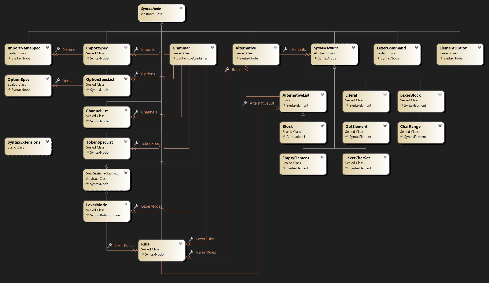

# Antlr4Ast User Guide

This is a small user guide about this library.

- [Getting started](#getting-started)
- [Class Diagram](#class-diagram)
- [Using the Visitor](#using-the-visitor)
- [Accessing rules](#accessing-rules)
- [Accessing Comments](#accessing-comments)
- [Merging Grammars](#merging-grammars)

## Getting started

The entry point for parsing an ANTLR4/g4 grammar is to use the `Grammar.Parse` methods:

```c#
var input = @"grammar MyGrammar;
// Parser rules starting here!
expr_a_plus_b
    : TOKEN_A '+' TOKEN_B
    ;
// Lexer rules starting here!
TOKEN_A: 'a';
TOKEN_B: 'b';
";
// Parse the grammar
var grammar = Grammar.Parse(input);
// Print the grammar
Console.WriteLine(
    grammar.ToString(
        new AntlrFormattingOptions() { 
                    MultiLineWithComments = true 
        }
    )
);
```

will print the following:

```antlr
grammar MyGrammar;

// Parser rules starting here!
expr_a_plus_b
  : TOKEN_A '+' TOKEN_B
  ;

// Lexer rules starting here!
TOKEN_A
  : 'a'
  ;

TOKEN_B
  : 'b'
  ;
```


## Class Diagram

The AST is defined with the following main classes:



* The base class for all AST nodes is `SyntaxNode` and contains the span location and the attached comments (before/after) this specific node.
* The entry point for navigating the grammar is from the `Grammar` class.
* Lexer and Parser rules are sharing the same model with `Rule` class.
  * This design is to simplify the model.
  * The `SyntaxElement` base class contains a few specific lexer or parser properties.
  * You will see a property name prefixed by `Lexer` if it applies only to a lexer context.
* The library does not contain a validation when manipulating the AST. You need to respect ANTLR rules e.g:
  * Lexer rules names start with a capital letter.
  * Grammar rules names must be lower case.

Iterating on the AST can be done easily by navigating from the `Grammar` down the lexer or parser `Rule`, `Alternative` and `Element` or by using the [visitor](#using-the-visitor).

For example, the following code process the previous lexer rules in a specific way:

```c#
foreach (var rule in grammar.LexerRules)
{
    Console.WriteLine($"Lexer rule `{rule.Name}`:");
    foreach (var alternative in rule.AlternativeList.Items)
    {
        Console.Write($" ->| ");
        foreach (var element in alternative.Elements)
        {
            Console.WriteLine($"`element => {element}` - {element.GetType().Name}`");
        }
    }
    Console.WriteLine();
}
```

And will print the following:

```
Lexer rule `TOKEN_A`:
 ->| `element => 'a'` - Literal`

Lexer rule `TOKEN_B`:
 ->| `element => 'b'` - Literal`
```

## Using the Visitor

You can inherit the `GrammarVisitor` or `GrammarVisitor<TResult>` to process an entire grammar with the visitor pattern:

```c#
class PrintVisitor : GrammarVisitor
{
    public PrintVisitor()
    {
        Builder = new StringBuilder();
    }

    public StringBuilder Builder { get; }

    public override void DefaultVisit(SyntaxNode node)
    {
        Builder.AppendLine($"{node.GetType().Name} - {node.Span}");
        base.DefaultVisit(node);
    }
}
```

You can override the various `Visit` methods to perform specific visit.

## Accessing rules

For convenience, you can find a lexer or parser rule by name with the `TryGetRule` method:

```c#
grammar.TryGetRule("TOKEN_A", out var tokenA);
Console.WriteLine(tokenA);
```

This is assuming that rules are not changed (e.g `Grammar.LexerRules`). If rules are changed/updated, you need to update the map:

```c#
// Update maps
grammar.UpdateRulesMap();
```

You don't need to update the map after parsing a grammar. This is done automatically.

## Accessing Comments

Comments are attached to the closest syntax node. For instance, if a rule definition has a comment in the previous line, the comment will be attached to the `Rule`.

```c#
grammar.TryGetRule("TOKEN_A", out var tokenA);
Console.WriteLine(tokenA);
foreach(var comment in comment.CommentsBefore) {
    Console.WriteLine(comment);
}
```

## Merging Grammars

When parsing a grammar with this library, it won't handle automatically the loading of import and dependent lexer grammars. You need to load them separately and then merge them.

For example:

```c#
// Load all the ANTLR4 Parser, Lexer, and Lexer fragments
var parserGrammar = Grammar.Parse(File.ReadAllText(@"ANTLRv4Parser.g4"), @"ANTLRv4Parser.g4");
var lexerGrammar = Grammar.Parse(File.ReadAllText(@"ANTLRv4Lexer.g4"), @"ANTLRv4Lexer.g4");
var basicLexerGrammar = Grammar.Parse(File.ReadAllText(@"LexBasic.g4"), @"LexBasic.g4");

// Merge all them
lexerGrammar.MergeFrom(basicLexerGrammar);
parserGrammar.MergeFrom(lexerGrammar);

// Our parser grammar is now a full grammar
// This has to be done manually.
parserGrammar.Kind = GrammarKind.Full;
```

